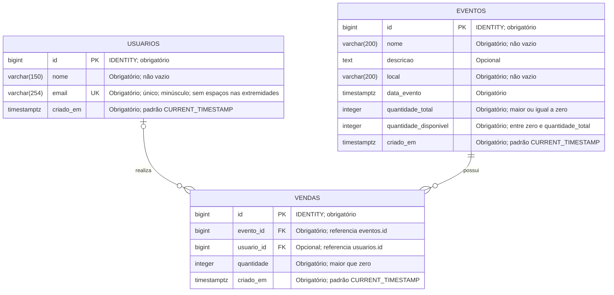

# Diagrama de Entidade-Relacionamento

Modelo inicial do Sistema de Venda de Ingressos, baseado nas entidades e regras da [Documentação NP1](Trabalho%20Sistemas%20Distribuidos%20Documentacao%20NP1.md). Implementação PostgreSQL: [schema.sql](../bd/schema.sql).



**Legenda:** PK = chave primária; FK = chave estrangeira; UK = valor único. `IDENTITY` gera o identificador automaticamente. Os nomes em maiúsculas no diagrama correspondem às tabelas em minúsculas no SQL. `TIMESTAMPTZ` representa um instante com suporte a fuso horário; sua exibição depende do fuso da sessão.

## Relacionamentos

| Relacionamento | Cardinalidade e regra |
| --- | --- |
| Evento → vendas | Um evento pode ter zero ou muitas vendas. Cada venda pertence obrigatoriamente a um único evento. |
| Usuário → vendas | Um usuário pode ter zero ou muitas vendas. Cada venda pode estar vinculada a zero ou um usuário. `usuario_id` nulo representa compra sem cadastro. |

As chaves estrangeiras usam `ON DELETE RESTRICT` e `ON UPDATE RESTRICT`: um evento ou usuário referenciado por vendas não pode ser excluído nem ter seu identificador alterado enquanto houver essas referências. Não há exclusão em cascata do histórico.

## Regras e decisões do modelo

- **Usuários:** guardam identificação, sem senha ou estrutura de autenticação. A associação opcional segue a documentação, que relaciona o comprador à venda quando aplicável. A aplicação deve remover espaços nas extremidades e converter e-mails para minúsculas antes de gravar; o banco rejeita valores fora desse padrão e duplicados. A validação do formato fica na aplicação.
- **Eventos:** nome, descrição, local e data permitem apresentar o evento. `quantidade_total` registra o estoque inicial e deve permanecer fixa durante as vendas nesta versão. No cadastro, `quantidade_disponivel` deve receber o mesmo valor de `quantidade_total`; o SQL exige que ambos sejam informados.
- **Vendas:** cada registro representa uma compra confirmada de uma ou mais unidades de um único evento. Compras recusadas não são inseridas. Não há status de pagamento, reserva, reembolso ou tabela de ingressos individuais, pois esses recursos não fazem parte do escopo inicial.
- **Integridade:** quantidades são inteiras; vendas exigem quantidade positiva; o saldo não pode ficar negativo nem superar o total. As FKs impedem referências a eventos e usuários inexistentes. Índices em `vendas.evento_id` e `vendas.usuario_id` apoiam consultas pelos relacionamentos.
- **Concorrência:** a operação de compra deverá verificar disponibilidade, reduzir o saldo e registrar a venda em uma única transação, com bloqueio de linha ou atualização condicional. Qualquer falha deve desfazer toda a operação. Essas operações serão implementadas na etapa de lógica de venda; o esquema, isoladamente, não evita divergências entre estoque e registros de venda.

Para um evento sem alteração de capacidade, a regra a validar na implementação e nos testes é:

```text
quantidade_disponivel = quantidade_total - soma(vendas.quantidade do evento)
```

Quando não há vendas, a soma vale zero. Essa igualdade envolve duas tabelas e não é garantida pelos `CHECK` deste esquema; depende da operação transacional e de impedir alterações diretas fora do fluxo de compra.

## Criação do esquema

Executar [schema.sql](../bd/schema.sql) uma vez em um banco de desenvolvimento sem essas tabelas, pelo editor SQL do PostgreSQL/Supabase ou, na raiz do projeto, com:

```bash
psql "$DATABASE_URL" -v ON_ERROR_STOP=1 -f bd/schema.sql
```

`DATABASE_URL` deve estar configurada no ambiente. O arquivo cria as três tabelas, restrições, índices e comentários dentro de uma transação. Não apaga tabelas existentes nem funciona como migração de um esquema anterior. Não inclui dados de exemplo, operação de compra ou configuração de permissões/RLS; o acesso será feito pela API, conforme a arquitetura do projeto.
